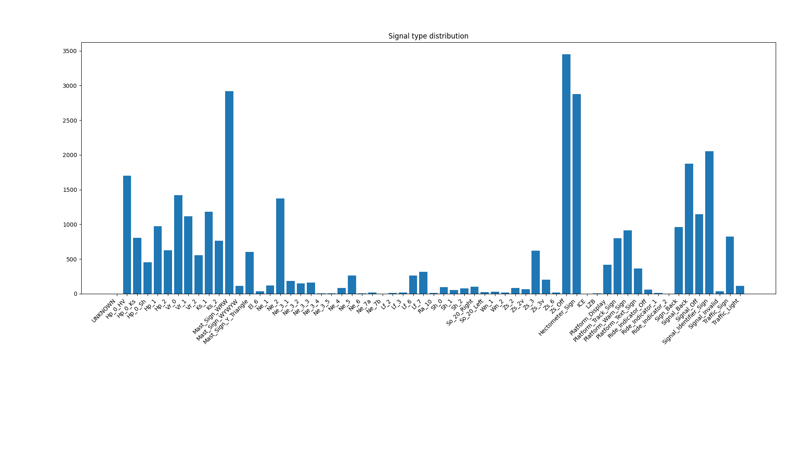

<!--
*** Thanks for checking out this README Template. If you have a suggestion that would
*** make this better, please fork the repo and create a pull request or simply open
*** an issue with the tag "enhancement".
*** Thanks again! Now go create something AMAZING! :D
-->


<!-- PROJECT SHIELDS -->
<!--
*** I'm using markdown "reference style" links for readability.
*** Reference links are enclosed in brackets [ ] instead of parentheses ( ).
*** See the bottom of this document for the declaration of the reference variables
*** for contributors-url, forks-url, etc. This is an optional, concise syntax you may use.
*** https://www.markdownguide.org/basic-syntax/#reference-style-links
-->

<!-- GERSign LOGO -->

<div align="center">
  <a href="https://git.rwth-aachen.de/IFS/gersign">
    
  </a>
</div>


  <div align="center">
  <small>
    “Ks-Vorsignal (Ks 1)”, by "Markus5linger", licensed under CC BY 4.0
  </small>
  </div>


  <h3 align="center"> The GERALD Dataset</h3>

  <div align="center">
    <b>Ge</b>rman <b>Ra</b>ilway <b>L</b>ightsignal <b>D</b>ataset
  </div>


<!-- TABLE OF CONTENTS -->

## Table of Contents

* [About the Project](#about-the-project)
  * [General Information](#general-information)
  * [Research Paper](#research-paper)
  * [Data Format](#data-format)
  * [Data Gathering](#how-the-data-was-gathered)
* [Getting Started](#getting-started)
  * [Download the Dataset](#download-the-dataset)
  * [Install the python support library](#install-the-python-support-library)
* [Usage](#usage)
* [Contributing](#contributing)
* [Contributors](#contributors)
* [License](#license)
* [Contact](#contact)
* [Related datasets](#related-datasets)


<!-- ABOUT THE PROJECT -->
## About The Project


<div align="center">
  <a href="https://github.com/ifs-rwth-aachen/GERSign">
    
  </a>    
</div>


### General Information

The GERALD dataset contains 5000 individual images and annotations for 33554 occurring objects. Our focus was to annotate occuring lightsignals, however, we decided to also include annotations for other occuring objects (mostly static signs) for more a comprehensive understanding of the enviroment. From the three existing signalling systems used in Germany we decided to only gather images from the H/V- and Ks-Signalling-System. The additional Hl-Signalling-System is only in use on some tracks in the territory of former East Germany and we only found a few available videos showing these signals. The signal aspects of the H/V- and Ks-System form the main classes of the dataset:

* H/V-Signalling-System: Hp 0 (HV), Hp 1, Hp 2, Vr 0, Vr 1, Vr 2
* Ks-Signalling-System: Hp 0 (Ks), Ks 1, Ks 2

The following table specifies how many instances of each main class were labelled:

| Hp 0 (HV) | Hp 1   | Hp 2  | Vr 0   | Vr 1   | Vr 2  | Hp 0 (Ks) | Ks 1   | Ks 2  |
| --------- | ------ | ----- | ------ | ------ | ----- | --------- | ------ | ----- |
| 1700      | 973    | 627   | 1422   | 1115   | 554   | 807       | 1182   | 761   |
| 18.6 %    | 10.6 % | 6.9 % | 15.6 % | 12.2 % | 6.1 % | 8.8 %     | 12.9 % | 8.3 % |

Nevertheless many more signal types were labelled to obtain a more complete dataset regarding German mainline railway signals and to enable detection of mast signs, hectometre signs etc. The following figure shows all classes and their corresponding amount of labelled instances.



For each image we also added information about the weather and light condition which distributes as follows:

| Unknown | Sunny  | Cloudy | Rainy  | Snowy | Foggy |
| ------- | ------ | ------ | ------ | ----- | ----- |
| 565     | 996    | 1925   | 1068   | 164   | 282   |
| 11.3 %  | 19.9 % | 38.5 % | 21.4 % | 3.3 % | 5.6 % |

<sub><sup>Unknown weather tag is used for pictures at night or in tunnels*</sup></sub>

| Daylight | Twilight | Dark   |
| -------- | -------- | ------ |
| 2969     | 1401     | 630    |
| 59.4 %   | 28.0 %   | 12.6 % |

### Example Video
[](https://www.youtube.com/watch?v=-ZJ2rtyu7_Q)


This video exemplary shows a YOLOv4 based detector trained on the GERALD dataset.
### Research Paper

An accompying publication can be found here: https://journals.sagepub.com/doi/10.1177/09544097231166472. The paper includes more information about autonomous driving in railways in general and additional statistics and a deeper analysis of the dataset. We also show some exemplary results based on a YOLOv4 network trained on GERALD. 

### Data format

For easy data handling and revision the annotations come in the PASCAL VOC format. This format consists of individual XML-files for every image containing all labelled instances and additional information like width and height of the image. All further information that does not comply with the PASCAL VOC format is saved in the info.json (e.g. weather, light, source url). The PASCAL VOC uses a "difficult" tag for each annotation. For this case the difficult tag was used to indicate if the signal was relevant to the train conductor in that situation

The images come in the .jpg format and are either 1280x720 or 1920x1080.

### How the data was gathered

The individual frames were created from video recordings from cab view rides which have been uploaded to YouTube. We asked the uploaders for permission to use their video material for our dataset. Microsofts video annotation tool [VoTT](https://github.com/microsoft/VoTT) was used to find and annotate relevant frames, in a second the step the images and annotations were revised and checked with [LabelImg](https://github.com/tzutalin/labelImg)

<!-- GETTING STARTED -->
## Getting Started

### Download the Dataset

The images and annotations can be found [here](https://doi.org/10.18154/RWTH-2024-02040)

### Install the python support library

##### Install via pip

```sh
pip install gerald-tools
```

##### Install using this repo

1. Install git ([Instructions](https://git-scm.com/book/en/v2/Getting-Started-Installing-Git))

2. Clone the repo

   ```sh
   git clone git@github.com:ifs-rwth-aachen/GERALD.git
   ```

3. The main.py includes some example code to load the dataset and display one image including the annotations

<!-- CONTRIBUTING -->

## Contributing

If you want to contribute to the dataset or our research, please contact us. You can find our contact information further below.

## Contributors

We would like to thank all YouTubers by supporting us with their cab view recordings and kindly allow us to use their material. The following YouTubers contributed their material to our dataset:

- [Tf on Tour](https://www.youtube.com/channel/UC-IVgRwev81WZ5J9CN9T--A)
- [Ananas 747](https://www.youtube.com/channel/UCNLlR8wGbXNVVT_IAwI8qpg)
- [German Express Driver](https://www.youtube.com/channel/UCgfJB0BN0x2qYqqpple5OOw)
- [Rotausleuchtung](https://www.youtube.com/channel/UCZXB_WOu2iSYZeWj1C4p2Zg)

<!-- LICENSE -->
## License

<a rel="license" href="http://creativecommons.org/licenses/by-nc-sa/4.0/"></a> The GERALD Dataset (Annotations for the respective images) by Philipp Leibner and Fabian Hampel is licensed under a <a rel="license" href="http://creativecommons.org/licenses/by-nc-sa/4.0/">Creative Commons Attribution-NonCommercial-ShareAlike 4.0 International License</a>.

The gerald-tools provided in this repository are licensed under the Apache 2.0 License.


<!-- CONTACT -->
## Contact

Philipp Leibner - philipp.leibner@ifs.rwth-aachen.de 	Fabian Hampel - fabian.hampel@ifs.rwth-aachen.de

<div>  
<a href="">
    
  </a>
</div>

<!-- ACKNOWLEDGEMENTS -->

## Related Dataset
* [RailSem19](https://wilddash.cc/railsem19) (For general semantic scene understanding of railway related scenes)
* [FRSign](https://frsign.irt-systemx.fr/) (Dataset for French railway signals)
* [COCO](https://cocodataset.org/#home) (Includes bounding boxes for trains, cars and traffic lights (treats railway signals as traffic lights))


<!-- MARKDOWN LINKS & IMAGES -->
<!-- https://www.markdownguide.org/basic-syntax/#reference-style-links -->

[contributors-shield]: https://img.shields.io/github/contributors/othneildrew/Best-README-Template.svg?style=flat-square
[contributors-url]: https://github.com/othneildrew/Best-README-Template/graphs/contributors
[forks-shield]: https://img.shields.io/github/forks/othneildrew/Best-README-Template.svg?style=flat-square
[forks-url]: https://github.com/othneildrew/Best-README-Template/network/members
[stars-shield]: https://img.shields.io/github/stars/othneildrew/Best-README-Template.svg?style=flat-square
[stars-url]: https://github.com/othneildrew/Best-README-Template/stargazers
[issues-shield]: https://img.shields.io/github/issues/othneildrew/Best-README-Template.svg?style=flat-square
[issues-url]: https://github.com/othneildrew/Best-README-Template/issues
[license-shield]: https://img.shields.io/github/license/othneildrew/Best-README-Template.svg?style=flat-square
[license-url]: https://github.com/othneildrew/Best-README-Template/blob/master/LICENSE.txt
[linkedin-shield]: https://img.shields.io/badge/-LinkedIn-black.svg?style=flat-square&logo=linkedin&colorB=555
[linkedin-url]: https://linkedin.com/in/othneildrew
[example-screenshot]: example.png
